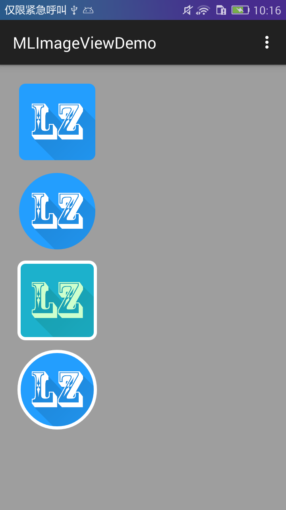

#自定义 MLImageView 控件

这个自定义ImageView控件实现了图片的圆角、圆形、边框等功能，同时具有按下改变颜色的效果，通过属性设置可以自定义按下的颜色，
以及颜色的透明度；还尅定义边框的颜色
##Demo截图：


##使用方法
使用方法很简单，就像在xml布局文件使用其他控件你那样引用就好；如果你不想引用过多的库， 可以直接复制MLImageView类到自己的项目中，
进行修改加工，让控件和自己的项目进行整合
```java
<net.melove.dome.mlimageview.MLImageView
        android:layout_width="96dp"
        android:layout_height="96dp"
        android:layout_margin="8dp"
        android:src="@mipmap/lz_bp_blue"
        melove:border_color="@color/ml_white"
        melove:border_width="4dp"
        melove:press_alpha="50"
        melove:press_color="#00ff00"
        melove:radius="8dp"
        melove:shape_type="rectangle" />
```

##注意
要记着有一点，在使用自定义控件之前一定要添加自定义命名空间
xmlns:melove="http://schemas.android.com/apk/res-auto"

##关于
博客：http://blog.melove.net
知乎：http://www.zhihu.com/people/lzan13